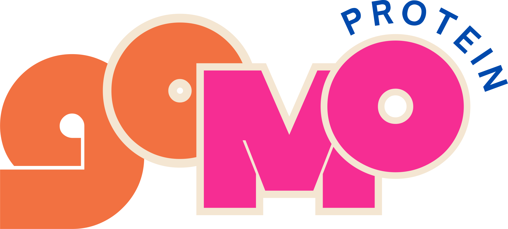

<h1 align="center" style="position: relative;">
	<br>
		
	<br>
	Golu Molu
</h1>

A carefully structured, well-loved, colorful Shopify theme custom-designed for [our website](https://drinkgolumolu.com/). Designed with modularity, maintainability, and my as-I-went-along best practices in mind.

## Getting started

### Prerequisites

Before starting, ensure you have the latest Shopify CLI installed:

- [Shopify CLI](https://shopify.dev/docs/api/shopify-cli) – helps you download, upload, preview themes, and streamline your workflows

If you use VS Code:

- [Shopify Liquid VS Code Extension](https://shopify.dev/docs/storefronts/themes/tools/shopify-liquid-vscode) – provides syntax highlighting, linting, inline documentation, and auto-completion specifically designed for Liquid templates

### Clone

Clone this repository using Git or Shopify CLI:

```bash
git clone git@github.com:AnmolS1/honey-i-drank-the-lassi.git
# or
shopify theme init
```

### Preview

Preview this theme using Shopify CLI:

```bash
shopify theme dev
```

## License

This theme is open-sourced under the [MIT](./LICENSE.md) License.
